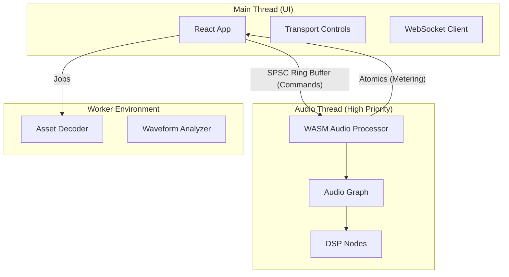

# AMPLITUDE 🎹

> **The Production-Grade Browser DAW powered by Rust & WebAssembly.**


**Amplitude** is a high-performance Digital Audio Workstation (DAW) running entirely in the browser. It bridges the gap between native desktop audio capability and the web's accessibility by leveraging a **Lock-Free Rust Audio Engine** compiled to WebAssembly.

---

## 🚀 Key Capabilities

*   **⚡ Zero-Latency Audio Engine**: Built in Rust with manual memory management, compiling to WASM for near-native performance.
*   **🧵 Lock-Free Concurrency**: Utilizes `SharedArrayBuffer` and atomic ring buffers (SPSC) for thread-safe communication between the UI and Audio Thread without blocking.
*   **🎛️ Real-Time DSP**: Sample-accurate scheduling and processing of effects (EQ, Compression, Reverb).
*   **🎹 Multi-Track Sequencing**: Full non-linear editing, automation, and MIDI sequencing.
*   **🤝 Collaborative**: Real-time multi-user editing via WebSockets and CRDTs.

---

## 🛠️ Technology Stack

### Core Audio Engine
*   **Language**: **Rust** (Safety, Performance, SIMD)
*   **Compilation target**: `wasm32-unknown-unknown`
*   **API**: **AudioWorklet** (Web Audio API) for sample-level processing.
*   **Architecture**:
    *   **No-GC Hot Path**: Custom allocators/pools for audio buffers.
    *   **Triple Buffering**: For lock-free visualization data transfer.

### Frontend
*   **Framework**: **React 18** + **TypeScript**
*   **Build Tool**: **Vite**
*   **State Management**: Zustand / Recoil (planned)
*   **Rendering**: HTML5 Canvas + WebGL for waveforms.

### Backend (Planned)
*   **Server**: **Rust (Axum)**
*   **Database**: PostgreSQL
*   **Storage**: S3-compatible object storage for project assets.

---

## 📐 System Architecture

Amplitude uses a distinct thread model to ensure the UI never stutters and the audio never crackles.



---

## 🚦 Getting Started

### Prerequisites
*   **Rust**: Stable toolchain (`rustup`)
*   **Node.js**: v18+
*   **Wasm-Pack**: `cargo install wasm-pack`

### Installation

1.  **Clone the repository**
    ```bash
    git clone https://github.com/yourusername/amplitude.git
    cd amplitude
    ```

2.  **Build the Audio Engine (WASM)**
    ```bash
    # This compiles the Rust code to ./frontend/src/wasm
    cd frontend
    npm run build:wasm
    ```

3.  **Install dependencies and Run**
    ```bash
    npm install
    npm run dev
    ```

4.  **Open in Browser**
    Visit `http://localhost:5173`.
    > **Note**: The server must send `Cross-Origin-Opener-Policy: same-origin` and `Cross-Origin-Embedder-Policy: require-corp` headers for `SharedArrayBuffer` to work. The included Vite config handles this.

---

## 🗺️ Roadmap

### Phase 1: Foundation (✅ Completed)
- [x] Lock-Free Ring Buffer (SPSC implementation)
- [x] Basic Audio Graph & Node Trait
- [x] WASM/JS Bridge & Glue code
- [x] Simple Gain & Oscillator Nodes

### Phase 2: Multi-Track Engine (🚧 In Progress)
- [ ] Track Mixer & Channel Strips
- [ ] Clip Scheduling
- [ ] Waveform Visualization

### Phase 3: DSP Library
- [ ] Biquad EQ, Compressor, Reverb
- [ ] Parameter Smoothing

### Phase 4: Creative Tools
- [ ] MIDI Sequencing & Piano Roll
- [ ] Subtractive Synthesizer

### Phase 5: Cloud
- [ ] Real-time Collaboration
- [ ] Cloud Save/Load

---

## 🔒 Performance Guarantees

Amplitude adheres to strict real-time safety rules in the audio thread:
1.  **No Allocation**: All audio buffers are pre-allocated at startup.
2.  **No Locking**: Mutexes are banned in the `process()` callback.
3.  **No System Calls**: No I/O or logging in the hot path.

---

## 📄 License

Distributed under the MIT License. See `LICENSE` for more information.

---

*Built with ❤️ by the Amplitude Team*
