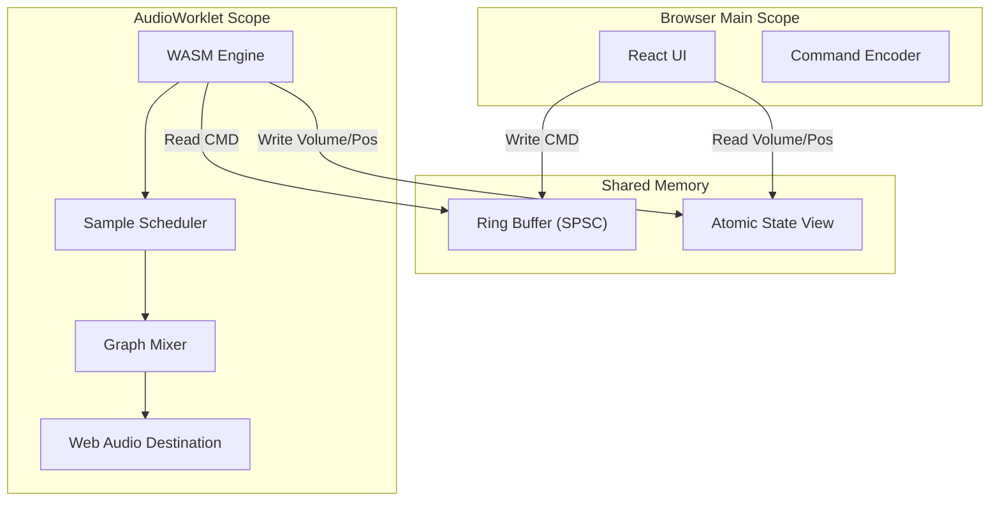

# AMPLITUDE 🎹

> **The Production-Grade Browser DAW powered by Rust & WebAssembly.**


**Amplitude** is a high-performance, professional Digital Audio Workstation (DAW) engineered to run natively in the browser. It challenges the traditional desktop-only paradigm by leveraging **WebAssembly (WASM)** and **Rust** to deliver sample-accurate audio processing with near-native performance (~10-20ms latency).

Unlike typical web audio toys, Amplitude is built on a **Shared Memory Concurrency Model**, sidestepping the JavaScript Garbage Collector to ensure glitch-free audio even under heavy CPU loads.

---

## 🛠️ Built With

<div align="center">

| **Core Audio Engine** | **Frontend Interface** | **Backend Infrastructure** |
|:---------------------:|:----------------------:|:--------------------------:|
|  <br>  |  <br>  <br>  |  <br>  |

</div>

---

## 🔬 Deep Dive: Engineering Architecture

Amplitude is not just a React App wrapper around `Tone.js`. It is a custom-built signal processing engine.

### 1. The Thread Model
The browser environment is hostile to real-time audio due to the Single-Threaded Event Loop and Garbage Collection pauses. Amplitude solves this using a **Triple-Thread Architecture**:

1.  **Main Thread (UI)**: React 18 managing the DOM, WebGL Canvas for rendering, and WebSocket state. It *never* touches audio buffers directly.
2.  **AudioWorklet Thread (The "Real-Time" Realm)**: A dedicated high-priority thread where our **WASM Module** lives. This thread pulls audio inputs, runs the DSP graph, and pushes samples to the DAC.
    *   **Constraint**: No memory allocation (malloc/free).
    *   **Constraint**: No locks (Mutex/RwLock).
    *   **Constraint**: No JS objects in the hot path.
3.  **Worker Pool**: Background threads for heavy lifting—decoding MP3/WAV files, generating peak data for waveforms, and rendering offline exports.

### 2. Lock-Free Communication (SharedArrayBuffer)
To communicate between the UI (React) and the Engine (Rust) without blocking, we utilize **SharedArrayBuffer** and `Atomics`.

*   **Command Queue (SPSC Ring Buffer)**: The UI writes commands (e.g., `Play`, `SetGain(0.5)`, `AddNode(EQ)`) into a lock-free Single-Producer Single-Consumer ring buffer. The Audio thread consumes these at the start of every render quantum (approx 2.9ms).
*   **Metering & Analysis**: The Audio thread writes atomic float values (volume levels, playhead position) to a shared memory region, which the UI polls via `requestAnimationFrame` for 60fps locking-free visualization.

### 3. The Audio Graph
The core engine implements a Directed Acyclic Graph (DAG) for signal routing:
*   **Nodes**: Rust structures implementing the `AudioNode` trait (Oscillators, Samplers, Effects).
*   **Buffers**: Pre-allocated memory pools re-used every cycle to prevent GC pressure.
*   **SIMD**: Heavy effects (EQ, Reverb) utilize WebAssembly SIMD 128-bit instructions for parallel processing.



---

## 📦 Project Structure

The project is structured as a Monorepo to keep the Rust backend, WASM engine, and Frontend tightly synchronised.

```text
amplitude/
├── audio-engine/       # 🦀 Rust: The Core DSP Engine (compiles to WASM)
│   ├── src/processor.rs#    AudioWorkletProcessor implementation
│   ├── src/graph.rs    #    Audio Graph & Node Trait
│   └── src/nodes/      #    DSP Implementations (EQ, Reverb, Osc)
├── frontend/           # ⚛️ TypeScript: The React UI
│   ├── src/audio/      #    Context Manager & Worklet Glue
│   ├── src/wasm/       #    Generated WASM bindings
│   └── src/components/ #    UI Components (Transport, Mixer, Timeline)
├── backend/            # 🦀 Rust: API Server (Axum)
│   └── src/main.rs     #    Auth, WebSockets, Project Management
└── shared/             # 🤝 Rust: Logic shared between Engine & Backend
    └── src/lib.rs      #    RingBuffer & Command Schemas
```

---

## 🚦 Getting Started

### Prerequisites
*   **Rust**: Stable toolchain (`rustup`)
*   **Node.js**: v18+
*   **Wasm-Pack**: `cargo install wasm-pack`

### Installation

1.  **Clone the repository**
    ```bash
    git clone https://github.com/yourusername/amplitude.git
    cd amplitude
    ```

2.  **Build the Audio Engine (WASM)**
    ```bash
    # This compiles the Rust code into optimized WASM
    cd frontend
    npm run build:wasm
    ```

3.  **Install dependencies and Run**
    ```bash
    npm install
    npm run dev
    ```

4.  **Open in Browser**
    Visit `http://localhost:5173`.
    > **Note**: The server requires `Cross-Origin-Opener-Policy: same-origin` and `Cross-Origin-Embedder-Policy: require-corp` headers to enable `SharedArrayBuffer`.

---

## 🔒 Performance Guarantees

Amplitude adheres to strict real-time safety rules:
1.  **Alloc-Free Hot Path**: All audio buffers are pre-allocated.
2.  **Wait-Free Synchronization**: No Mutexes in the `process()` callback.
3.  **Pure Data**: The Engine is purely mathematical; all state is derived from the command stream.

---

## 📄 License

Distributed under the MIT License. See `LICENSE` for more information.

---

*Built with ❤️ by the Amplitude Team*
